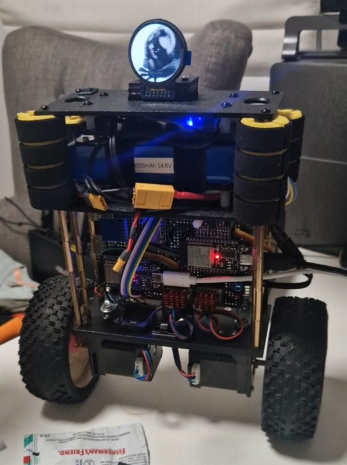
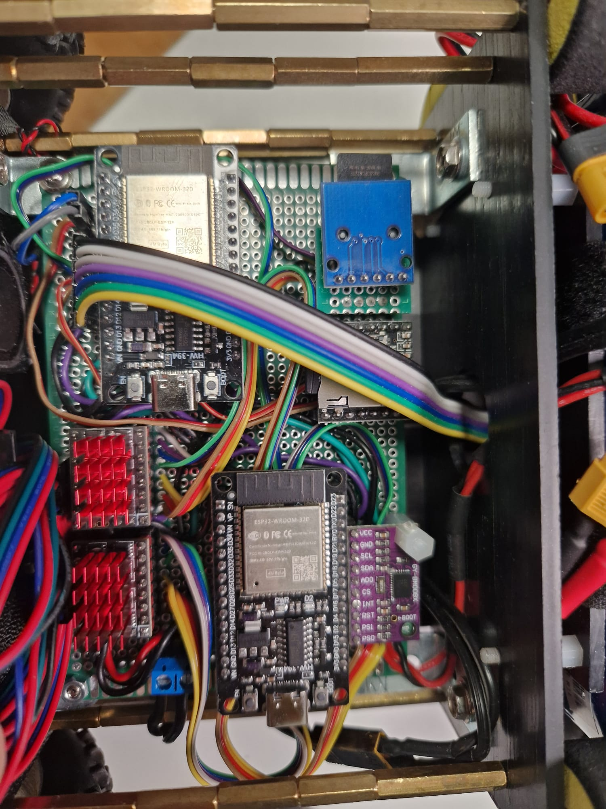
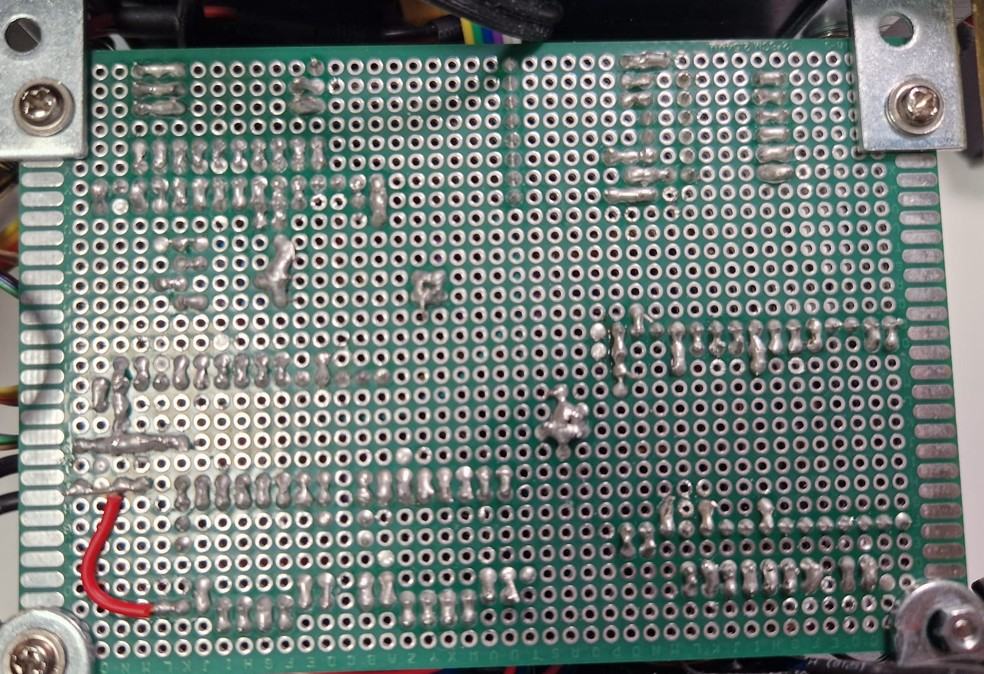

# Stepper Balance Robot 

## Description
A shoebox sized robot that can balance on two wheels. It uses a PID controller to maintain its balance and can be controlled over Bluetooth via an Android app.
It uses an ESP32 microcontroller, BNO085 IMU, two TMC5160T motor drivers, and two NEMA17 (~1.5A) stepper motors.
The robot is powered by a 3-4S LiPo battery and the chassis consists of metal spacers and 3-4mm PLA sheets.

Apart from the usual components, it has a 240x240 round LCD display and speaker driven by DFPlayer Mini MP3 module.

## Setting up for Development
1. Install VSCode and the PlatformIO extension.
2. Open one of the PlatformIO projects in VSCode (has platformio.ini in root).
3. Install Android Studio
4. Open the client app in Android Studio and run it on your phone.

## Architecture

### Control ESP32
- The ESP32 is the main controller of the robot. 
- It runs the PID controller and communicates with the motor drivers (SPI) and IMU (i2c).
- It has a HardwareSerial connection to the IO-ESP32.
- Control frequency is 200Hz.

### IO ESP32
- The IO ESP32 is responsible for the Bluetooth communication with the Android app.
- It has a HardwareSerial connection to the Control ESP32.
- It is connected to the LCD display (SPI), DFPlayer Mini (Software Serial), SD card module (SPI), and the other ESP32 (Hardware Serial).
- It receives commands from the Android app and sends them to the Control ESP32.
- It also processes the relevant commands.
- It can play sounds and display messages on the LCD with 15+ modes.

## Control / Balance Algorithm
- Cascade PID controller
- The current speed is calculated by the rolling average of the last 500ms
- Speed PID calculates a target roll angle
- Roll PID calculates the target speed of the motors
- The control input applies a difference to the target speed on each motor
- The Stepper motor has a maximum acceleration of ~10000-20000 steps/s², therefore the control output is dampened.
- The control output is limited to 8000 steps/s (Micro stepping: 16)

## Features
- Bluetooth control via Android app
- Diagnostic data streaming and rendering on the app (target roll angle, current roll angle, target speed, current speed, motor speed)
- PID tuning via Android app
- Displaying GIFs on LCD and Sound effects via DFPlayer Mini
- Balancing, driving, and turning

## Planned Features
- Battery feedback and monitoring
- Using a phone game controller Joystick for control

## Bill of Materials
| Component                                         | Quantity   | Description                                           |
|---------------------------------------------------|------------|-------------------------------------------------------|
| ESP32                                             | 2          | 30 pin                                                |
| BNO085                                            | 1          | IMU                                                   |
| TMC5160T                                          | 2          | Motor driver                                          |
| NEMA17                                            | 2          | Stepper motor, between 1.5A-2.1A nominal current      |
| LiPo battery                                      | 1          | 3-4S, 2200-30000mAh                                   |
| LCD                                               | 1          | 240x240 round LCD display                             |
| Speaker                                           | 1          | 8 ohm, 0.5W-2W                                        |
| DFPlayer Mini                                     | 1          | MP3 module                                            |
| Micro-SD card module                              | 1          | Micro-SD card module                                  |
| Metal spacer 25mm                                 | 16         | M3 metal spacer for the lower section                 |
| Metal spacer 20mm                                 | 12         | M3 metal spacer for the upper section                 |
| 3mm PLA sheet                                     | 2          | 150x65 (2), 35x100 (2)                                |
| 4mm PLA sheet                                     | 1          | 150x65                                                |
| NEMA17 mount                                      | 2          | Metal 90 degree bracket for NEMA17 motor              |
| M3 screws                                         | ?          | 6mm-16mm                                              |
| M3 nuts                                           | ?          | M3 nuts                                               |
| Plastic spacer 15mm                               | 9          | M3 plastic spacer for the upper section               |
| 120x80 double PCB                                 | 1          | Double sided prototype PCB                            |
| XT30 connector                                    | 2          | XT30 connector for power connection                   |
| XT60 connector                                    | 1          | XT60 connector for power connection                   |
| 2A 5V DC-DC converter                             | 1          | DC-DC converter for the ESP32                         |
| Pull-down resistor 10k                            | 1          | 10k pull-down resistor for not-used pins              |
| Skotchky diode 1N5819                             | 2          | Schottky diode for ESP32 5V in                        |
| 90 deg. PCB cable connector                       | 2          | 3pin, 2pin                                            |
| 2 SD cards                                        | 2          | 2x 16GB SD cards                                      |
| 3 pole XT30 connector                             | 1          | 3 pole XT30 connector for ESP32 5V                    |
| Bumper foam roll                                  | 4          | 30mm wide Bumper foam for the robot                   |
| 90 deg mounting bracket for PCB                   | 4          | 90 deg mounting bracket for PCB                       |
| 3D Printed 6mm hex to 17MM hex                    | 2          | 3D printed hex to hex adapter                         |
| 2 Nitro Buggy wheels                              | 2          | Nitro buggy wheels for the robot, ca. 110mm diam.     | 
| 18AWG copper cable for power connection           | 1          | ~ 1-2m                                                |
| 20-wide Jumper wires                              | 1          | ~ 2-3m                                                |

## Incidents

With limited experience with electronics it's part of the game. :)

### Incident Zero
I used the same connector for the 13V and 5V. I was so excited to test, that I plugged the 5V into the 13V rail.
The ESP32 voltage regulator was glowing and removed itself from the PCB flying with 50-80 cm trajectory.
I was somewhat cautious and did not insert the other components. Luckily.

### First Incident
I tried to debug both ESP32 at the same time via USB, but the 5V and 3.3V rails were connected.
This caused voltage differences and all low voltage components got damaged.
The PCB was also manufactured in a very amateurish way, so I decided to make a new one.

### Second Incident
Even though I made a 3 pole XT30 connector, so I can disconnect the 5V rail.
I tried to debug the ESP32 via USB, but the 5V rail was still connected. 
I unplugged the wrong connector...

### Component Graveyard

| Component     | Quantity       | Description       |
|---------------|----------------|-------------------|
| ESP32         | 1              | Incident Zero     |
| ESP32         | 2              | First Incident    |
| BNO085        | 1              | First Incident    |
| TMC5160T      | 2              | First Incident    |
| PCB Prototype | 1              | First Incident    |
| ESP32         | 1              | Second Incident   |

## Pictures

## History
- I made two robots before with geared DC motors and encoders. (around 2017 and 2019)
- Both could stand, but they were not very stable and could not drive.
- I changed to stepper motors to gain new experience and hoping for better results.
- Over the years I also got maturated and started to do things slower and more carefully.
- 
